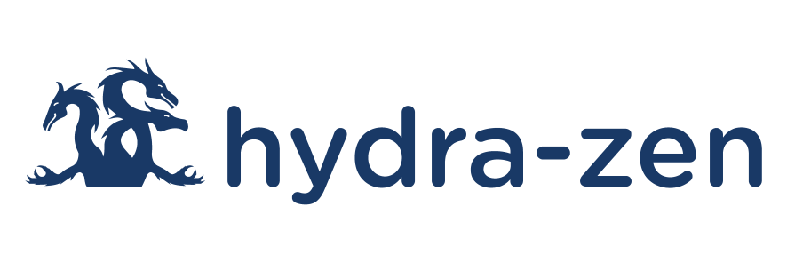

# hydra-zen



<p align="center">
  <a href="https://pypi.python.org/pypi/hydra-zen">
    
  </a>
  <a>
    
  </a>
  <a href="https://github.com/mit-ll-responsible-ai/hydra-zen/actions?query=workflow%3ATests+branch%3Amain">
    
  <a href="https://github.com/mit-ll-responsible-ai/hydra-zen/actions?query=workflow%3ATests+branch%3Amain">
    
  <a href="https://github.com/microsoft/pyright/blob/92b4028cd5fd483efcf3f1cdb8597b2d4edd8866/docs/typed-libraries.md#verifying-type-completeness">
    
  <a href="https://hypothesis.readthedocs.io/">
    
  </a>
  <a href="https://zenodo.org/badge/latestdoi/354130346">
    
  </a>
  <p align="center">
    A library that facilitates configurable, reproducible, and scalable workflows, using Hydra.
  </p>
  <p align="center">
    Check out our <a href="https://mit-ll-responsible-ai.github.io/hydra-zen/">documentation</a> for more information.
  </p>
  <p align="center">
    Interested in machine learning? Check out our guide <a href="https://mit-ll-responsible-ai.github.io/hydra-zen/how_to/pytorch_lightning.html">for using PyTorch Lightning with hydra-zen.⚡</a>
  </p>
</p>


hydra-zen is a Python library that simplifies the process of writing code (research-grade or production-grade) that is:

- **Configurable**: you can configure all aspects of your code from a single interface (the command line or a single Python function).
- **Repeatable**: each run of your code will be self-documenting; the full configuration of your software is saved alongside your results.
- **Scalable**: launch multiple runs of your software, be it on your local machine or across multiple nodes on a cluster.


It builds off – and is fully compatible with – [Hydra](https://hydra.cc/), a framework for elegantly 
configuring complex applications. hydra-zen helps simplify the 
process of using Hydra by providing specialized functions for creating configs and 
launching Hydra jobs. Please refer to [our documentation](https://mit-ll-responsible-ai.github.io/hydra-zen/) for examples and more details.


  
## Installation
`hydra-zen` is lightweight: its only dependencies are `hydra-core` and `typing-extensions`.

```console
pip install hydra-zen
```

## Contributing

Before opening a PR to this repo, consider posting an [issue](https://github.com/mit-ll-responsible-ai/hydra-zen/issues) or a [discussion topic](https://github.com/mit-ll-responsible-ai/hydra-zen/discussions) to share your ideas with us. We will work with you to ensure your feature is well-scoped and that your hard work goes to good use.

(See an obvious bug or typo? Go ahead and just open a PR :) )

For further details refer to [these docs](https://github.com/mit-ll-responsible-ai/hydra-zen/blob/main/CONTRIBUTING.md).


## Join the Discussion

Share ideas, ask questions, and chat with us over at [hydra-zen's discussion board](https://github.com/mit-ll-responsible-ai/hydra-zen/discussions).


## Citation

Using `hydra-zen` for your research? Please cite the following publication:

```
@article{soklaski2022tools,
  title={Tools and Practices for Responsible AI Engineering},
  author={Soklaski, Ryan and Goodwin, Justin and Brown, Olivia and Yee, Michael and Matterer, Jason},
  journal={arXiv preprint arXiv:2201.05647},
  year={2022}
}
```

## Disclaimer

DISTRIBUTION STATEMENT A. Approved for public release: distribution unlimited.

© 2023 MASSACHUSETTS INSTITUTE OF TECHNOLOGY
    
    Subject to FAR 52.227-11 – Patent Rights – Ownership by the Contractor (May 2014)
    SPDX-License-Identifier: MIT
    
This material is based upon work supported by the Under Secretary of Defense for Research and Engineering under Air Force Contract No. FA8702-15-D-0001. Any opinions, findings, conclusions or recommendations expressed in this material are those of the author(s) and do not necessarily reflect the views of the Under Secretary of Defense for Research and Engineering.

A portion of this research was sponsored by the United States Air Force Research Laboratory and the United States Air Force Artificial Intelligence Accelerator and was accomplished under Cooperative Agreement Number FA8750-19-2-1000. The views and conclusions contained in this document are those of the authors and should not be interpreted as representing the official policies, either expressed or implied, of the United States Air Force or the U.S. Government. The U.S. Government is authorized to reproduce and distribute reprints for Government purposes notwithstanding any copyright notation herein.

The software/firmware is provided to you on an As-Is basis
